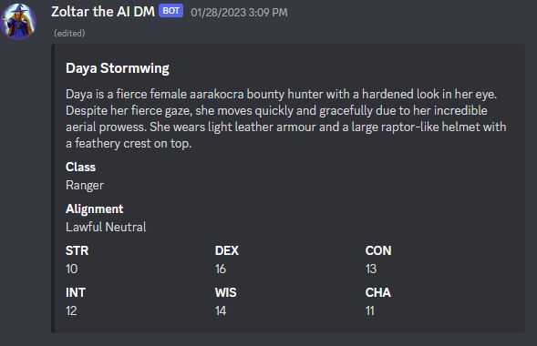

# Zoltan AI DM Discord Bot

A discord AI bot for generating items, npcs, and other DND stat blocks.

[](https://github.com/graytonio/zoltan-bot/actions/workflows/release.yaml)

## Usage

---
The recommended way to run the bot is by using the docker container

### Docker Compose

```yaml
version: "3.8"
services:
  zoltan:
    image: ghcr.io/graytonio/zoltan-bot:latest
    container_name: zoltan
    restart: unless-stopped
    environment:
      - OPENAI_API_KEY=${OPENAI_API_KEY}
      - DISCORD_BOT_TOKEN=${DISCORD_BOT_TOKEN}
      - DISCORD_APP_ID=${DISCORD_APP_ID}
      - DISCORD_TEST_SERVER_ID=${DISCORD_TEST_SERVER_ID}
```

### Docker CLI

```bash
docker run -d \
  --name=zoltan
  -e OPENAI_API_KEY=${OPENAI_API_KEY}
  -e DISCORD_BOT_TOKEN=${DISCORD_BOT_TOKEN}
  -e DISCORD_APP_ID=${DISCORD_APP_ID}
  -e DISCORD_TEST_SERVER_ID=${DISCORD_TEST_SERVER_ID}
  --restart unless-stopped
  ghcr.io/graytonio/zoltan-bot:latest -e
```

## CLI Mode

---
The bot can also be run as a CLI tool to generate responses in a terminal.  The cli assumes that the OPENAI_API_KEY env variable is set in the shell it is run it to work properly.

```bash
➜ zoltan-bot --help
A discord bot for generating AI DND resources

Usage:
  zoltan-bot [flags]
  zoltan-bot [command]

Available Commands:
  completion  Generate the autocompletion script for the specified shell
  gen         Use a generator in the cli
  help        Help about any command

Flags:
  -h, --help   help for zoltan-bot

Use "zoltan-bot [command] --help" for more information about a command.
```

## Example Output

---


```bash
➜ ./dist/zoltan-bot_linux_amd64_v1/zoltan-bot gen npc --race genasi
Name: Kunar Ollekhan, Description: Kunar is a towering figure, with a muscular build and auburn skin. He wears armor crafted from metal plates and hides. His features are sharp, and his eyes gleam with an orange hue., Class: Fighter, Alignment: Lawful Neutral, Stats: { Strength: 16, Dexterity: 14, Constitution: 14, Intelligence: 10, Wisdom: 13, Charisma: 11 }
```
